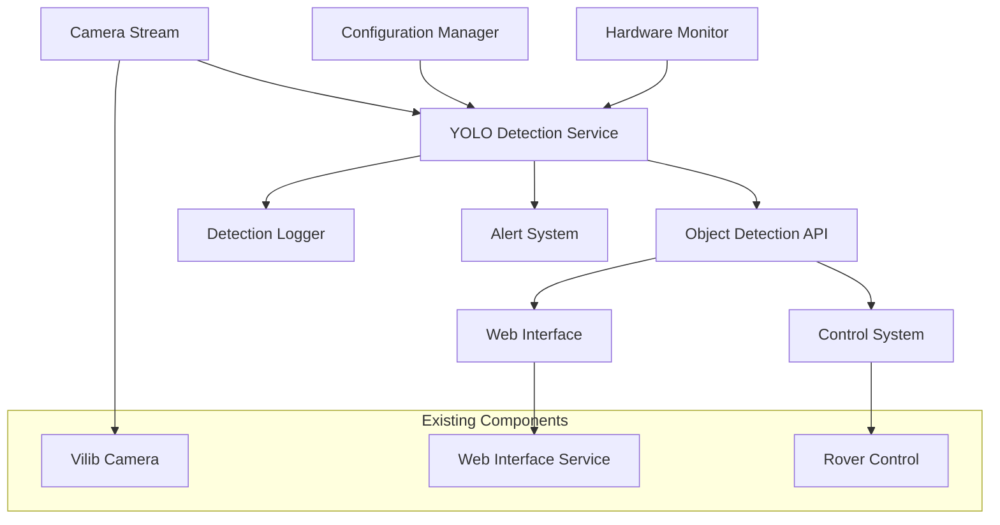

# YOLO Object Detection Design Document

## Overview

This design document outlines the implementation of YOLO (You Only Look Once) object detection capabilities for the Blue Rover project. The system will integrate real-time object detection into the existing camera streaming infrastructure, providing enhanced situational awareness and enabling autonomous behaviors. The implementation is optimized for Raspberry Pi 4+ hardware constraints while maintaining acceptable performance for real-time operation.

The design follows the existing project architecture patterns, integrating seamlessly with the current hardware abstraction layer, web interface, and service management system. The YOLO detection service will run as a separate systemd service, communicating with other components through well-defined APIs and shared data structures.

## Architecture

### High-Level Architecture



### Component Architecture

The YOLO integration consists of several key components:

1. **YOLO Detection Engine**: Core detection processing using optimized YOLO models
2. **Frame Processing Pipeline**: Efficient frame capture and preprocessing
3. **Detection API Service**: RESTful API for accessing detection results
4. **Web Interface Integration**: Enhanced UI with detection visualization
5. **Configuration Management**: Dynamic configuration for detection parameters
6. **Alert and Notification System**: Configurable alerts for specific detections
7. **Performance Monitor**: Resource usage monitoring and optimization

### Service Integration

The YOLO detection service integrates with existing Blue Rover services:

- **Camera Service**: Receives video frames from the existing Vilib camera system
- **Web Interface**: Displays detection results and provides configuration controls
- **Configuration System**: Uses existing rover configuration management
- **Logging System**: Integrates with existing logging infrastructure
- **Hardware Abstraction**: Respects hardware resource constraints and monitoring

## Components and Interfaces

### YOLO Detection Engine

**Purpose**: Core object detection processing using optimized YOLO models

**Key Features**:
- Support for YOLOv5 and YOLOv8 models optimized for Raspberry Pi
- Hardware acceleration using available GPU/NPU resources
- Dynamic model switching based on performance requirements
- Configurable confidence thresholds and NMS parameters

**Interface**:
```python
class YOLODetectionEngine:
    def __init__(self, model_path: str, device: str = 'cpu')
    def detect_objects(self, frame: np.ndarray) -> List[Detection]
    def set_confidence_threshold(self, threshold: float) -> None
    def set_enabled_classes(self, classes: List[str]) -> None
    def get_performance_stats(self) -> Dict[str, float]
```

**Model Selection Strategy**:
- **YOLOv5n**: Nano model for maximum performance on Pi 4 (primary choice)
- **YOLOv8n**: Alternative nano model with improved accuracy
- **Custom trained models**: Support for domain-specific models (e.g., dog detection)

### Frame Processing Pipeline

**Purpose**: Efficient capture, preprocessing, and distribution of video frames

**Key Features**:
- Non-blocking frame capture from Vilib camera stream
- Automatic frame resizing and preprocessing for YOLO input
- Frame rate adaptation based on system performance
- Memory-efficient frame buffering

**Interface**:
```python
class FrameProcessor:
    def __init__(self, input_size: Tuple[int, int] = (640, 640))
    def start_processing(self) -> None
    def stop_processing(self) -> None
    def get_latest_frame(self) -> Optional[np.ndarray]
    def set_target_fps(self, fps: int) -> None
```

**Processing Pipeline**:
1. Frame capture from Vilib camera stream
2. Frame resizing to YOLO input dimensions (640x640 default)
3. Color space conversion (BGR to RGB)
4. Normalization and tensor preparation
5. Frame buffering for detection processing

### Detection API Service

**Purpose**: RESTful API service for accessing detection results and configuration

**Endpoints**:
- `GET /api/detections/current` - Current detection results
- `GET /api/detections/history` - Recent detection history
- `POST /api/detections/config` - Update detection configuration
- `GET /api/detections/stats` - Performance statistics
- `POST /api/detections/alerts` - Configure alert settings

**Data Models**:
```python
@dataclass
class Detection:
    class_name: str
    confidence: float
    bbox: Tuple[int, int, int, int]  # x1, y1, x2, y2
    timestamp: float
    frame_id: int

@dataclass
class DetectionResult:
    detections: List[Detection]
    frame_timestamp: float
    processing_time: float
    frame_size: Tuple[int, int]
```

### Web Interface Integration

**Purpose**: Enhanced web interface with object detection visualization and controls

**New Features**:
- Real-time detection overlay on camera stream
- Detection configuration panel
- Performance monitoring dashboard
- Alert configuration interface
- Detection history viewer

**UI Components**:
- **Detection Overlay**: Bounding boxes and labels on live video stream
- **Control Panel**: Toggle detection on/off, adjust settings
- **Statistics Dashboard**: FPS, detection counts, performance metrics
- **Alert Configuration**: Set up alerts for specific object classes
- **History Viewer**: Browse recent detection events

### Configuration Management

**Purpose**: Dynamic configuration system for detection parameters

**Configuration Structure**:
```json
{
  "yolo_detection": {
    "enabled": true,
    "model_path": "models/yolov5n.pt",
    "confidence_threshold": 0.5,
    "nms_threshold": 0.4,
    "input_size": [640, 640],
    "target_fps": 10,
    "enabled_classes": ["person", "car", "bicycle", "dog"],
    "alerts": {
      "enabled": true,
      "alert_classes": ["person", "dog"],
      "confidence_threshold": 0.7,
      "rate_limit_seconds": 30
    },
    "performance": {
      "max_cpu_usage": 80,
      "adaptive_fps": true,
      "use_hardware_acceleration": true
    }
  }
}
```

### Alert and Notification System

**Purpose**: Configurable alert system for specific object detections

**Features**:
- Class-specific alert configuration
- Confidence threshold filtering
- Rate limiting to prevent alert spam
- Multiple notification channels (logs, web interface, external APIs)

**Alert Types**:
- **High Priority**: Person detection alerts
- **Medium Priority**: Vehicle detection alerts
- **Low Priority**: General object detection alerts
- **Custom**: User-defined alert rules

### Performance Monitor

**Purpose**: Monitor and optimize system performance for Raspberry Pi constraints

**Monitoring Metrics**:
- CPU usage and temperature
- Memory usage and availability
- Detection processing time
- Frame rate and dropped frames
- Model inference time

**Optimization Strategies**:
- Adaptive frame rate based on system load
- Dynamic model switching (nano vs. small models)
- Frame skipping during high load
- Memory management and garbage collection

## Data Models

### Core Detection Data Structures

```python
from dataclasses import dataclass
from typing import List, Dict, Optional, Tuple
from enum import Enum

class ObjectClass(Enum):
    PERSON = "person"
    CAR = "car"
    BICYCLE = "bicycle"
    DOG = "dog"
    CAT = "cat"
    MOTORCYCLE = "motorcycle"
    BUS = "bus"
    TRUCK = "truck"

@dataclass
class BoundingBox:
    x1: int
    y1: int
    x2: int
    y2: int
    
    @property
    def center(self) -> Tuple[int, int]:
        return ((self.x1 + self.x2) // 2, (self.y1 + self.y2) // 2)
    
    @property
    def area(self) -> int:
        return (self.x2 - self.x1) * (self.y2 - self.y1)

@dataclass
class Detection:
    object_class: ObjectClass
    confidence: float
    bbox: BoundingBox
    timestamp: float
    frame_id: int
    tracking_id: Optional[int] = None

@dataclass
class DetectionFrame:
    detections: List[Detection]
    frame_timestamp: float
    processing_time: float
    frame_size: Tuple[int, int]
    total_objects: int
    
@dataclass
class PerformanceMetrics:
    fps: float
    avg_processing_time: float
    cpu_usage: float
    memory_usage: float
    dropped_frames: int
    total_detections: int
```

### Configuration Data Models

```python
@dataclass
class YOLOConfig:
    enabled: bool = True
    model_path: str = "models/yolov5n.pt"
    confidence_threshold: float = 0.5
    nms_threshold: float = 0.4
    input_size: Tuple[int, int] = (640, 640)
    target_fps: int = 10
    enabled_classes: List[str] = None
    
@dataclass
class AlertConfig:
    enabled: bool = True
    alert_classes: List[str] = None
    confidence_threshold: float = 0.7
    rate_limit_seconds: int = 30
    
@dataclass
class PerformanceConfig:
    max_cpu_usage: int = 80
    adaptive_fps: bool = True
    use_hardware_acceleration: bool = True
    max_memory_mb: int = 1024
```

## Error Handling

### Error Categories and Strategies

**Model Loading Errors**:
- Fallback to alternative model files
- Graceful degradation to mock detection mode
- Clear error messages for missing model files
- Automatic model download if network available

**Hardware Resource Errors**:
- Automatic performance scaling when resources are constrained
- Frame rate reduction during high CPU usage
- Memory cleanup and garbage collection
- Graceful service restart on memory exhaustion

**Camera Integration Errors**:
- Fallback to mock camera frames for testing
- Retry mechanisms for camera connection issues
- Error logging without blocking other services
- Graceful handling of camera disconnection

**Detection Processing Errors**:
- Skip corrupted frames without stopping service
- Timeout handling for long-running detections
- Error recovery and service continuation
- Performance degradation alerts

### Error Recovery Mechanisms

```python
class ErrorRecoveryManager:
    def __init__(self):
        self.retry_counts = {}
        self.max_retries = 3
        self.backoff_multiplier = 2
    
    def handle_model_error(self, error: Exception) -> bool:
        """Handle model loading/inference errors"""
        # Implement retry logic with exponential backoff
        # Fallback to alternative models
        # Return True if recovery successful
        
    def handle_resource_error(self, error: Exception) -> bool:
        """Handle resource constraint errors"""
        # Reduce processing load
        # Free up memory
        # Adjust performance settings
        
    def handle_camera_error(self, error: Exception) -> bool:
        """Handle camera-related errors"""
        # Retry camera connection
        # Switch to mock mode if needed
        # Maintain service availability
```

## Testing Strategy

### Unit Testing

**YOLO Detection Engine Tests**:
- Model loading and initialization
- Object detection accuracy with known test images
- Performance benchmarking on target hardware
- Configuration parameter validation
- Error handling for invalid inputs

**Frame Processing Tests**:
- Frame capture and preprocessing accuracy
- Memory usage and leak detection
- Frame rate consistency testing
- Buffer management validation

**API Service Tests**:
- REST endpoint functionality
- Data serialization and deserialization
- Authentication and authorization
- Error response handling

### Integration Testing

**Camera Integration Tests**:
- End-to-end frame processing pipeline
- Integration with existing Vilib camera system
- Performance impact on camera streaming
- Concurrent access handling

**Web Interface Integration Tests**:
- Detection overlay rendering accuracy
- Real-time data updates via WebSocket
- Configuration changes propagation
- User interface responsiveness

**Service Integration Tests**:
- Systemd service lifecycle management
- Inter-service communication
- Resource sharing and conflict resolution
- Graceful shutdown and restart

### Performance Testing

**Raspberry Pi Hardware Tests**:
- CPU and memory usage under various loads
- Frame rate consistency across different scenarios
- Temperature monitoring during extended operation
- Power consumption impact assessment

**Load Testing**:
- Multiple concurrent detection requests
- High frame rate processing capability
- Memory usage under sustained operation
- Recovery from resource exhaustion

### Hardware-in-the-Loop Testing

**Real-world Scenario Tests**:
- Object detection accuracy in various lighting conditions
- Performance with different object densities
- Detection consistency during rover movement
- Integration with rover control systems

## Performance Optimization

### Raspberry Pi Specific Optimizations

**Model Optimization**:
- Use of quantized models (INT8) for faster inference
- Model pruning to reduce computational requirements
- TensorRT optimization for NVIDIA Jetson compatibility
- ONNX runtime optimization for CPU inference

**Memory Management**:
- Efficient frame buffering with circular buffers
- Memory pool allocation for detection objects
- Garbage collection optimization
- Memory mapping for model weights

**CPU Optimization**:
- Multi-threading for frame processing and detection
- NEON SIMD instructions utilization on ARM
- CPU affinity settings for consistent performance
- Process priority optimization

### Adaptive Performance Scaling

**Dynamic Frame Rate Adjustment**:
```python
class AdaptivePerformanceManager:
    def __init__(self):
        self.target_cpu_usage = 70
        self.current_fps = 10
        self.min_fps = 5
        self.max_fps = 15
    
    def adjust_performance(self, current_cpu: float) -> None:
        if current_cpu > self.target_cpu_usage:
            self.current_fps = max(self.min_fps, self.current_fps - 1)
        elif current_cpu < self.target_cpu_usage - 10:
            self.current_fps = min(self.max_fps, self.current_fps + 1)
```

**Resource Monitoring**:
- Continuous CPU and memory monitoring
- Temperature-based throttling
- Automatic quality reduction under load
- Service priority adjustment

## Security Considerations

### Data Privacy

**Frame Data Protection**:
- No persistent storage of video frames
- Encrypted transmission of detection data
- Configurable data retention policies
- User consent for detection logging

**Model Security**:
- Verification of model file integrity
- Secure model download and updates
- Protection against model poisoning attacks
- Sandboxed model execution environment

### Network Security

**API Security**:
- Authentication for detection API endpoints
- Rate limiting for API requests
- Input validation and sanitization
- HTTPS encryption for web interface

**Service Isolation**:
- Containerized service deployment option
- Limited file system access permissions
- Network namespace isolation
- Resource usage limits

## Deployment Strategy

### Installation and Setup

**Automated Installation**:
```bash
# Add to existing setup.sh script
install_yolo_dependencies() {
    echo "Installing YOLO detection dependencies..."
    
    # Install Python packages
    pip3 install torch torchvision --index-url https://download.pytorch.org/whl/cpu
    pip3 install ultralytics opencv-python-headless
    pip3 install onnxruntime
    
    # Download optimized models
    mkdir -p models
    wget -O models/yolov5n.pt https://github.com/ultralytics/yolov5/releases/download/v7.0/yolov5n.pt
    
    # Create systemd service
    create_yolo_service
}
```

**Service Configuration**:
```ini
[Unit]
Description=Blue Rover YOLO Object Detection Service
After=network.target blue-rover-camera.service
Requires=blue-rover-camera.service

[Service]
Type=simple
User=pi
WorkingDirectory=/home/pi/blue-rover
ExecStart=/home/pi/blue-rover/venv/bin/python -m src.yolo_detection_service
Restart=always
RestartSec=5
Environment=PYTHONPATH=/home/pi/blue-rover

[Install]
WantedBy=multi-user.target
```

### Configuration Management

**Environment-Specific Configs**:
- Development: High logging, mock hardware support
- Production: Optimized performance, minimal logging
- Testing: Comprehensive metrics, debug features

**Dynamic Configuration Updates**:
- Hot-reload of detection parameters
- Model switching without service restart
- Performance tuning based on hardware detection

### Monitoring and Maintenance

**Health Checks**:
- Service availability monitoring
- Performance metrics collection
- Error rate tracking
- Resource usage alerts

**Maintenance Tasks**:
- Model updates and optimization
- Log rotation and cleanup
- Performance tuning based on usage patterns
- Security updates and patches