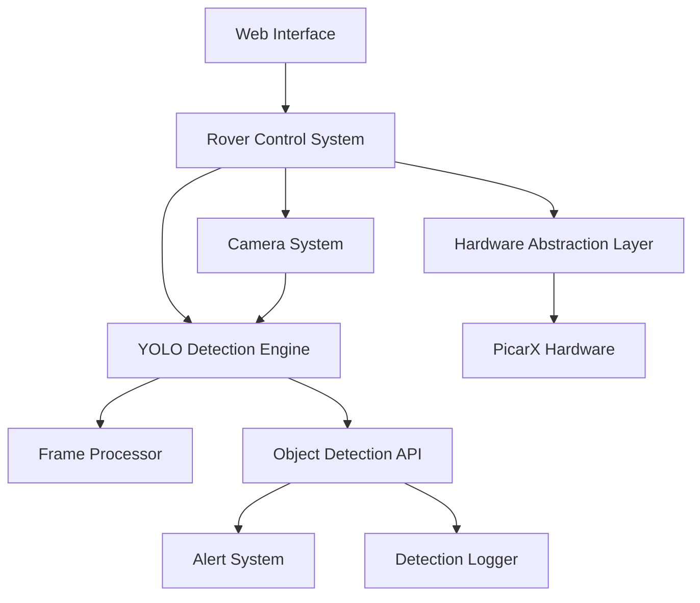

# Blue Rover - AI-Powered Raspberry Pi Robot Control System

A comprehensive robotics control system for Raspberry Pi featuring **YOLO object detection**, PS5 controller integration, manual keyboard control, live camera streaming, and intelligent autonomous behaviors. This project combines traditional robotics with modern computer vision and machine learning to create an educational and practical robotic platform.

## 🚀 Features

### Core Robotics Features
- **Multiple Control Modes**: PS5 controller, keyboard control, and web interface
- **Live Camera Streaming**: Real-time video feed with pan/tilt control
- **Battery Monitoring**: Continuous voltage monitoring with alerts
- **Remote SSH Access**: Secure remote operation from anywhere
- **Automated Setup**: One-command deployment on Raspberry Pi
- **Service Management**: Systemd integration for reliable operation
- **Web Interface**: Browser-based control and monitoring dashboard
- **Hardware Abstraction**: Modular design supporting different rover platforms

### 🤖 AI & Computer Vision Features
- **YOLO Object Detection**: Real-time object detection and classification
- **Intelligent Tracking**: Autonomous object following (e.g., dog tracking)
- **Configurable Detection**: Enable/disable specific object classes
- **Performance Optimization**: Raspberry Pi 4+ optimized inference
- **Alert System**: Configurable notifications for specific detections
- **Detection API**: RESTful API for accessing detection results
- **Visual Overlay**: Real-time bounding boxes and labels on video stream
- **Detection History**: Logging and analysis of detection events

## 📚 Educational Resources & Learning Guide

This project is designed to be both functional and educational. Whether you're a beginner or advanced developer, these resources will help you understand the technologies and concepts involved.

### 🎓 Core Concepts & Technologies

#### Robotics Fundamentals
- **[Introduction to Robotics](https://www.coursera.org/learn/robotics-basics)** - Stanford's comprehensive robotics course
- **[Robot Operating System (ROS) Tutorials](http://wiki.ros.org/ROS/Tutorials)** - Industry-standard robotics framework
- **[Raspberry Pi Robotics Guide](https://magpi.raspberrypi.org/books/robotics)** - Official Raspberry Pi robotics handbook
- **[PicarX Documentation](https://docs.sunfounder.com/projects/picar-x/en/latest/)** - Hardware platform documentation

#### Computer Vision & Machine Learning
- **[Computer Vision: Algorithms and Applications](http://szeliski.org/Book/)** - Comprehensive CV textbook (free PDF)
- **[Deep Learning for Computer Vision](https://cs231n.github.io/)** - Stanford CS231n course materials
- **[OpenCV Tutorials](https://docs.opencv.org/4.x/d9/df8/tutorial_root.html)** - Practical computer vision programming
- **[PyTorch Tutorials](https://pytorch.org/tutorials/)** - Deep learning framework used in this project

#### YOLO Object Detection Deep Dive
- **[YOLO: Real-Time Object Detection](https://pjreddie.com/darknet/yolo/)** - Original YOLO paper and explanation
- **[YOLOv5 Documentation](https://docs.ultralytics.com/yolov5/)** - Modern YOLO implementation
- **[Understanding YOLO Architecture](https://towardsdatascience.com/yolo-object-detection-explained-492dc9230006)** - Detailed technical explanation
- **[Object Detection Metrics](https://jonathan-hui.medium.com/map-mean-average-precision-for-object-detection-45c121a31173)** - Understanding mAP, IoU, and evaluation metrics

#### Raspberry Pi & Embedded Systems
- **[Raspberry Pi Foundation Learning](https://www.raspberrypi.org/learn/)** - Official learning resources
- **[GPIO Programming Guide](https://gpiozero.readthedocs.io/)** - Hardware interfacing with Python
- **[Raspberry Pi Camera Module Guide](https://www.raspberrypi.org/documentation/accessories/camera.html)** - Camera setup and programming
- **[Linux System Administration](https://linuxjourney.com/)** - Essential Linux skills for Pi development

### 🛠️ Technical Implementation Guides

#### Setting Up Your Development Environment
1. **Raspberry Pi Setup**
   - [Raspberry Pi OS Installation](https://www.raspberrypi.org/software/)
   - [SSH Configuration](https://www.raspberrypi.org/documentation/remote-access/ssh/)
   - [Camera Module Setup](https://www.raspberrypi.org/documentation/configuration/camera.md)

2. **Python Environment**
   - [Virtual Environments](https://docs.python.org/3/tutorial/venv.html)
   - [Package Management with pip](https://pip.pypa.io/en/stable/user_guide/)
   - [Requirements.txt Best Practices](https://pip.pypa.io/en/stable/user_guide/#requirements-files)

3. **Machine Learning Setup**
   - [PyTorch on Raspberry Pi](https://qengineering.eu/install-pytorch-on-raspberry-pi-4.html)
   - [Optimizing ML Models for Edge Devices](https://pytorch.org/tutorials/recipes/recipes/tuning_guide.html)
   - [Model Quantization](https://pytorch.org/tutorials/advanced/static_quantization_tutorial.html)

#### Understanding the Codebase Architecture



### 🔬 Advanced Topics & Research

#### Computer Vision Research Papers
- **[You Only Look Once: Unified, Real-Time Object Detection](https://arxiv.org/abs/1506.02640)** - Original YOLO paper
- **[YOLOv4: Optimal Speed and Accuracy of Object Detection](https://arxiv.org/abs/2004.10934)** - YOLOv4 improvements
- **[EfficientDet: Scalable and Efficient Object Detection](https://arxiv.org/abs/1911.09070)** - Alternative detection architecture
- **[Real-time Object Detection on Mobile Devices](https://arxiv.org/abs/1704.04861)** - Mobile optimization techniques

#### Robotics & Autonomous Systems
- **[Probabilistic Robotics](http://www.probabilisticrobotics.org/)** - Advanced robotics algorithms
- **[Planning Algorithms](http://planning.cs.uiuc.edu/)** - Path planning and navigation
- **[Visual SLAM](https://github.com/raulmur/ORB_SLAM2)** - Simultaneous Localization and Mapping
- **[Behavior Trees in Robotics](https://arxiv.org/abs/1709.00084)** - AI decision-making frameworks

### 🎯 Project-Based Learning Path

#### Beginner Level (Weeks 1-4)
1. **Week 1**: Set up Raspberry Pi and basic Python programming
2. **Week 2**: Understand GPIO programming and hardware control
3. **Week 3**: Implement basic camera streaming and web interface
4. **Week 4**: Add PS5 controller integration and movement control

#### Intermediate Level (Weeks 5-8)
1. **Week 5**: Learn computer vision basics with OpenCV
2. **Week 6**: Understand neural networks and deep learning concepts
3. **Week 7**: Implement basic object detection with pre-trained models
4. **Week 8**: Optimize performance for Raspberry Pi hardware

#### Advanced Level (Weeks 9-12)
1. **Week 9**: Custom YOLO model training for specific objects
2. **Week 10**: Implement autonomous behaviors and decision-making
3. **Week 11**: Add multi-object tracking and advanced CV features
4. **Week 12**: Deploy and optimize for production use

### 🧪 Hands-On Experiments & Extensions

#### Beginner Experiments
- **LED Control**: Add LED indicators for different rover states
- **Sensor Integration**: Add ultrasonic sensors for obstacle detection
- **Sound Effects**: Add audio feedback for different actions
- **Custom Web UI**: Modify the web interface with new features

#### Intermediate Experiments
- **Object Following**: Make the rover follow detected objects
- **Gesture Recognition**: Control rover with hand gestures
- **Voice Commands**: Add speech recognition for voice control
- **Path Recording**: Record and replay movement paths

#### Advanced Experiments
- **SLAM Implementation**: Add mapping and localization
- **Multi-Robot Coordination**: Control multiple rovers simultaneously
- **Custom Object Training**: Train YOLO on custom object classes
- **Edge AI Optimization**: Implement TensorRT or ONNX optimization

### 📖 Recommended Books

#### Robotics & AI
1. **"Robotics: Modelling, Planning and Control"** by Bruno Siciliano
2. **"Artificial Intelligence: A Modern Approach"** by Stuart Russell
3. **"Deep Learning"** by Ian Goodfellow, Yoshua Bengio, and Aaron Courville
4. **"Computer Vision: Models, Learning, and Inference"** by Simon J.D. Prince

#### Programming & Engineering
1. **"Effective Python"** by Brett Slatkin
2. **"Clean Code"** by Robert C. Martin
3. **"Design Patterns"** by Gang of Four
4. **"The Pragmatic Programmer"** by David Thomas

### 🌐 Online Communities & Forums

- **[r/robotics](https://www.reddit.com/r/robotics/)** - Reddit robotics community
- **[ROS Discourse](https://discourse.ros.org/)** - Robot Operating System discussions
- **[OpenCV Forum](https://forum.opencv.org/)** - Computer vision help and discussions
- **[Raspberry Pi Forums](https://www.raspberrypi.org/forums/)** - Official Pi community
- **[PyTorch Forums](https://discuss.pytorch.org/)** - Deep learning framework support
- **[Stack Overflow](https://stackoverflow.com/questions/tagged/robotics)** - Programming Q&A

### 🎥 Video Tutorials & Courses

#### YouTube Channels
- **[Two Minute Papers](https://www.youtube.com/c/KárolyZsolnai)** - Latest AI research explained
- **[3Blue1Brown](https://www.youtube.com/c/3blue1brown)** - Mathematical concepts behind AI
- **[Sentdex](https://www.youtube.com/c/sentdex)** - Python and machine learning tutorials
- **[ExplainingComputers](https://www.youtube.com/c/explainingcomputers)** - Raspberry Pi projects

#### Online Courses
- **[CS231n: Convolutional Neural Networks](http://cs231n.stanford.edu/)** - Stanford (Free)
- **[Fast.ai Practical Deep Learning](https://course.fast.ai/)** - Practical ML course (Free)
- **[Coursera Robotics Specialization](https://www.coursera.org/specializations/robotics)** - University of Pennsylvania
- **[edX Introduction to Robotics](https://www.edx.org/course/introduction-to-robotics)** - Columbia University

## Quick Start

### Prerequisites

- Raspberry Pi (3B+, 4, or Zero 2W) with Raspberry Pi OS
- PicarX robot kit or compatible hardware
- PS5 DualSense controller (optional)
- Camera module (optional)
- SSH access to your Pi

### Installation

1. **Clone the repository**:
   ```bash
   git clone https://github.com/ravila123/blue-rover.git
   cd blue-rover
   ```

2. **Run the setup script**:
   ```bash
   chmod +x setup.sh
   ./setup.sh
   ```

3. **Start the rover**:
   ```bash
   # For PS5 controller mode
   ./run_rover.sh ps5
   
   # For keyboard control
   ./run_rover.sh manual
   
   # For web interface with YOLO detection
   ./run_rover.sh web
   
   # For battery monitoring only
   ./run_rover.sh monitor
   
   # For YOLO detection testing
   ./run_rover.sh detect
   ```

### YOLO Object Detection Setup

The rover includes advanced YOLO object detection capabilities. Here's how to get started:

1. **Download YOLO models** (automatic on first run):
   ```bash
   # Models will be downloaded to models/ directory
   # YOLOv5n (nano) - optimized for Raspberry Pi
   # YOLOv8n (nano) - alternative high-performance model
   ```

2. **Configure detection settings**:
   ```bash
   # Edit config/rover_config.json
   {
     "yolo_detection": {
       "enabled": true,
       "model_path": "models/yolov5n.pt",
       "confidence_threshold": 0.5,
       "enabled_classes": ["person", "dog", "car", "bicycle"],
       "target_fps": 10
     }
   }
   ```

3. **Test object detection**:
   ```bash
   # Run detection test
   python3 -c "
   from src.detection.yolo_engine import YOLODetectionEngine
   from src.detection.config import YOLODetectionConfig
   import numpy as np
   
   config = YOLODetectionConfig.load_from_file('config/rover_config.json')
   engine = YOLODetectionEngine(config.yolo)
   
   # Test with sample frame
   frame = np.random.randint(0, 255, (480, 640, 3), dtype=np.uint8)
   detections = engine.detect_objects(frame)
   print(f'Detected {len(detections)} objects')
   "
   ```

### Remote Access Setup

1. **Configure SSH keys** (if not already done):
   ```bash
   # On your local machine
   ssh-keygen -t rsa -b 4096 -C "your_email@example.com"
   ssh-copy-id pi@your-pi-ip-address
   ```

2. **Connect remotely**:
   ```bash
   ssh pi@your-pi-ip-address
   cd blue-rover
   ./run_rover.sh web  # Access via browser at http://your-pi-ip:8080
   ```

## Project Structure

```
blue-rover/
├── README.md                 # This comprehensive guide
├── setup.sh                 # Main setup script
├── run_rover.sh             # Launcher script
├── requirements.txt          # Python dependencies (includes YOLO/ML packages)
├── src/                     # Source code
│   ├── blue_rover.py        # Main rover control system
│   ├── ps5_control.py       # PS5 controller interface
│   ├── battery_monitor.py   # Battery monitoring service
│   ├── camera_stream.py     # Camera streaming with detection overlay
│   ├── web_interface.py     # Web UI with YOLO visualization
│   ├── detection/           # YOLO object detection system
│   │   ├── __init__.py      # Detection module initialization
│   │   ├── yolo_engine.py   # Core YOLO detection engine
│   │   ├── frame_processor.py # Frame preprocessing pipeline
│   │   ├── detection_service.py # Detection service daemon
│   │   ├── models.py        # Data models for detections
│   │   └── config.py        # Detection configuration management
│   ├── hardware/            # Hardware abstraction layer
│   │   ├── __init__.py      # Hardware module initialization
│   │   ├── rover_interface.py # Abstract rover interface
│   │   ├── picarx_rover.py  # PicarX implementation
│   │   ├── mock_rover.py    # Mock hardware for testing
│   │   └── hardware_factory.py # Hardware factory pattern
│   └── utils/               # Utility modules
│       ├── __init__.py      # Utils initialization
│       ├── enhanced_logging.py # Advanced logging system
│       └── logutil.py       # Logging utilities
├── models/                  # YOLO model files (auto-downloaded)
│   ├── yolov5n.pt          # YOLOv5 nano model (primary)
│   ├── yolov8n.pt          # YOLOv8 nano model (alternative)
│   └── .gitkeep            # Keep directory in git
├── config/                  # Configuration files
│   ├── rover_config.json   # Main configuration (includes YOLO settings)
│   ├── rover_config_development.json # Development settings
│   ├── systemd/            # Service definitions
│   │   ├── blue-rover-battery.service # Battery monitoring service
│   │   ├── blue-rover-camera.service  # Camera streaming service
│   │   └── blue-rover-detection.service # YOLO detection service
│   └── ssh/                # SSH configuration templates
│       ├── authorized_keys.template # SSH key template
│       └── sshd_config.security     # Secure SSH configuration
├── scripts/                 # Setup and utility scripts
│   ├── install_deps.sh     # Dependency installation
│   ├── setup_ssh.sh        # SSH configuration
│   ├── manage_services.sh  # Service management utilities
│   ├── validate_hardware.sh # Hardware validation
│   └── monitor_logs.py     # Log monitoring utility
├── tests/                   # Comprehensive test suite
│   ├── __init__.py         # Test module initialization
│   ├── test_yolo_engine.py # YOLO engine unit tests
│   ├── test_detection_pipeline.py # Detection pipeline tests
│   ├── test_hardware.py    # Hardware abstraction tests
│   ├── test_services.py    # Service integration tests
│   └── test_integration.py # End-to-end integration tests
├── docs/                    # Additional documentation
│   ├── DEVELOPMENT.md      # Development guidelines
│   ├── HARDWARE.md         # Hardware setup guide
│   ├── TROUBLESHOOTING.md  # Common issues and solutions
│   ├── WEB_INTERFACE.md    # Web interface documentation
│   └── SSH_SETUP.md        # SSH configuration guide
├── templates/              # Web interface templates
│   └── index.html          # Main web interface template
├── examples/               # Example scripts and demos
│   └── logging_demo.py     # Logging system demonstration
├── logs/                   # Runtime logs and data
│   ├── rover.log          # Main application logs
│   ├── detection.log      # YOLO detection logs
│   └── hardware_validation.log # Hardware test logs
└── venv/                   # Python virtual environment (created by setup)
```

## Usage

### Control Modes

**PS5 Controller Mode**:
- Left stick: Forward/backward movement
- Right stick: Steering
- L2/R2: Camera pan control
- L1/R1: Camera tilt control
- Triangle: Emergency stop

**Keyboard Control**:
- WASD: Movement control
- Arrow keys: Camera control
- Space: Emergency stop
- Q: Quit

**Web Interface**:
- Access at `http://your-pi-ip:8080`
- Virtual joystick for movement
- Camera controls and live stream with YOLO detection overlay
- Real-time object detection visualization
- Detection configuration panel
- System status dashboard with AI performance metrics

### YOLO Object Detection Usage

**Detection Configuration**:
```bash
# Enable/disable specific object classes
curl -X POST http://your-pi-ip:8080/api/detections/config \
  -H "Content-Type: application/json" \
  -d '{"enabled_classes": ["person", "dog", "car"]}'

# Adjust confidence threshold
curl -X POST http://your-pi-ip:8080/api/detections/config \
  -H "Content-Type: application/json" \
  -d '{"confidence_threshold": 0.7}'
```

**Real-time Detection API**:
```bash
# Get current detections
curl http://your-pi-ip:8080/api/detections/current

# Get detection history
curl http://your-pi-ip:8080/api/detections/history

# Get performance statistics
curl http://your-pi-ip:8080/api/detections/stats
```

**Autonomous Behaviors**:
- **Object Following**: Enable dog tracking mode for autonomous following
- **Alert System**: Configure notifications for specific object detections
- **Detection Logging**: Automatic logging of all detection events with timestamps

### Service Management

The system uses systemd services for background operations:

```bash
# Check service status
systemctl --user status blue-rover-battery
systemctl --user status blue-rover-camera

# Start/stop services
systemctl --user start blue-rover-battery
systemctl --user stop blue-rover-battery

# View logs
journalctl --user -u blue-rover-battery -f
```

## Configuration

Configuration files are located in the `config/` directory:

- `rover_config.json`: Main application settings
- `systemd/`: Service definitions
- `ssh/`: SSH configuration templates

Example configuration:
```json
{
  "camera_enabled": true,
  "camera_port": 8080,
  "log_level": "INFO",
  "battery_check_interval": 5,
  "max_speed": 100,
  "steering_range": 35
}
```

## Hardware Requirements

See [HARDWARE.md](docs/HARDWARE.md) for detailed hardware requirements and setup instructions.

## Troubleshooting

Common issues and solutions are documented in [TROUBLESHOOTING.md](docs/TROUBLESHOOTING.md).

## Development

For development guidelines and contribution information, see [DEVELOPMENT.md](docs/DEVELOPMENT.md).

## License

This project is licensed under the MIT License - see the LICENSE file for details.

## Support

- Create an issue on GitHub for bug reports
- Check the troubleshooting guide for common problems
- Review the hardware documentation for setup issues

## Acknowledgments

- Built for PicarX robot platform
- Inspired by the Raspberry Pi robotics community
- Thanks to all contributors and testers