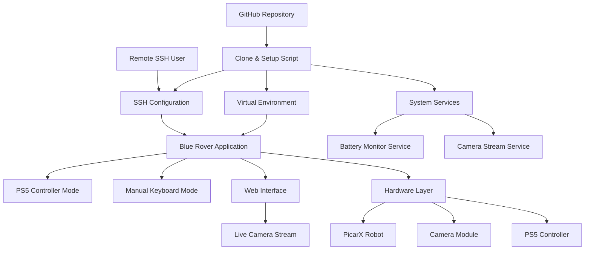
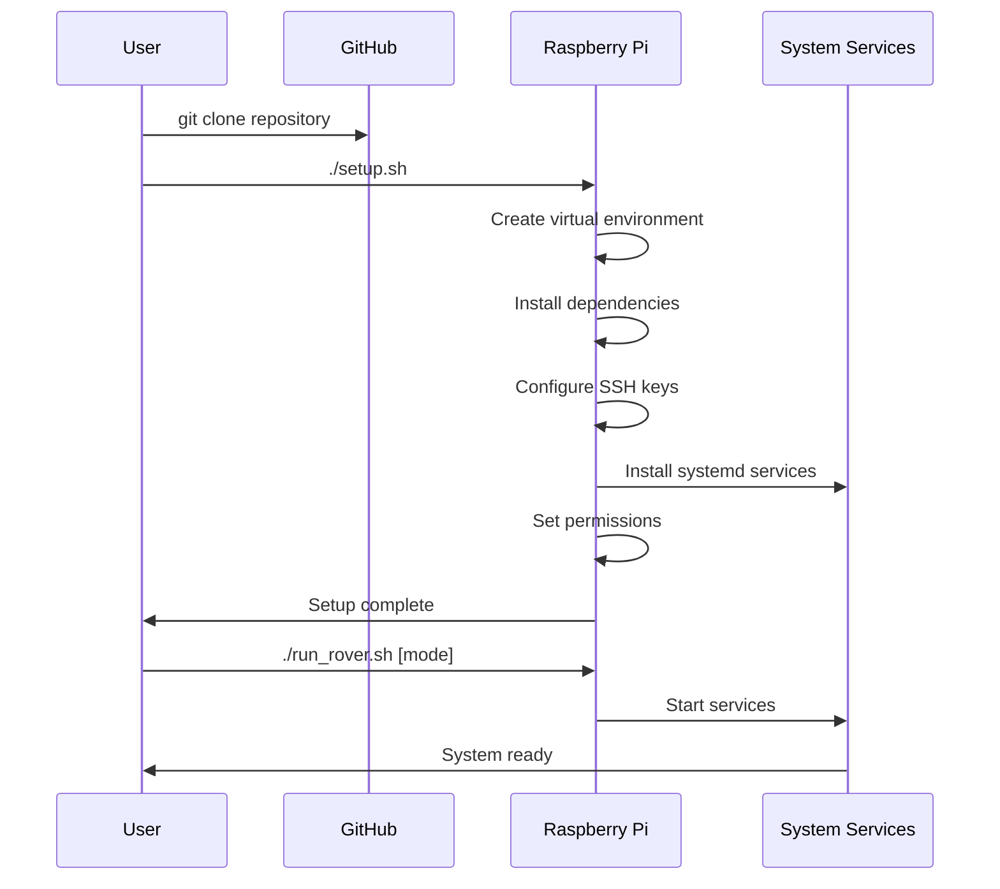

# Design Document

## Overview

The Blue Rover GitHub Deployment Setup transforms a collection of Python robotics control scripts into a professional, deployable system. The design focuses on creating a seamless deployment experience through automated setup scripts, proper project structure, comprehensive documentation, and robust service management for Raspberry Pi environments.

## Architecture

### System Components



### Deployment Flow



## Components and Interfaces

### 1. Project Structure

```
blue-rover/
├── README.md                 # Comprehensive project documentation
├── setup.sh                 # Main setup script
├── requirements.txt          # Python dependencies (fixed typo)
├── run_rover.sh             # Launcher script
├── src/                     # Source code directory
│   ├── __init__.py
│   ├── blue_rover.py        # Renamed from BlueRover.py
│   ├── ps5_control.py       # Renamed from PS5_Control.py
│   ├── battery_monitor.py   # Renamed from tbr_batt_monitor.py
│   └── utils/
│       ├── __init__.py
│       └── logutil.py
├── config/                  # Configuration files
│   ├── systemd/
│   │   ├── blue-rover-battery.service
│   │   └── blue-rover-camera.service
│   └── ssh/
│       └── authorized_keys.template
├── scripts/                 # Utility scripts
│   ├── install_deps.sh
│   ├── setup_ssh.sh
│   └── validate_hardware.sh
├── logs/                    # Runtime logs (created by setup)
├── tests/                   # Test suite
│   ├── test_hardware.py
│   └── test_services.py
└── docs/                    # Additional documentation
    ├── HARDWARE.md
    ├── TROUBLESHOOTING.md
    └── DEVELOPMENT.md
```

### 2. Setup Script Architecture

**setup.sh** - Main orchestrator:
- Detects system environment (Raspberry Pi OS version, Python version)
- Creates virtual environment in `venv/`
- Installs system dependencies (if needed)
- Calls specialized setup scripts
- Validates installation

**scripts/install_deps.sh**:
- Installs Python dependencies in virtual environment
- Handles system packages (camera drivers, bluetooth)
- Manages pip upgrades and conflicts

**scripts/setup_ssh.sh**:
- Configures SSH daemon for key-based auth
- Sets up user SSH directory
- Provides instructions for key generation

**scripts/validate_hardware.sh**:
- Tests PicarX hardware connectivity
- Validates camera functionality
- Checks PS5 controller pairing
- Reports system status

### 3. Service Management

**Systemd Services**:
- `blue-rover-battery.service` - Continuous battery monitoring
- `blue-rover-camera.service` - Camera stream service (optional)

**Service Features**:
- Automatic restart on failure
- Proper logging to journald
- Environment variable management
- User-level services (no root required)

### 4. Application Interface

**run_rover.sh** - Unified launcher:
```bash
./run_rover.sh manual    # Keyboard control
./run_rover.sh ps5       # PS5 controller
./run_rover.sh monitor   # Battery monitoring only
./run_rover.sh web       # Web interface mode
```

**Web Interface** (new component):
- Live camera stream viewer
- Basic rover controls via web UI
- System status dashboard
- Log file viewer

## Data Models

### Configuration Management

```python
# config/rover_config.py
@dataclass
class RoverConfig:
    camera_enabled: bool = True
    camera_port: int = 8080
    log_level: str = "INFO"
    battery_check_interval: int = 5
    max_speed: int = 100
    steering_range: int = 35
    
    @classmethod
    def from_file(cls, path: str) -> 'RoverConfig':
        # Load from JSON/YAML config file
        pass
```

### Hardware Abstraction

```python
# src/hardware/rover_interface.py
class RoverInterface:
    """Abstract interface for rover hardware"""
    
    def move_forward(self, speed: int) -> None:
        pass
    
    def move_backward(self, speed: int) -> None:
        pass
    
    def set_steering(self, angle: int) -> None:
        pass
    
    def get_battery_voltage(self) -> float:
        pass
    
    def set_camera_position(self, pan: int, tilt: int) -> None:
        pass

class PicarXRover(RoverInterface):
    """PicarX implementation"""
    # Existing functionality wrapped in interface
```

### Logging Enhancement

```python
# src/utils/enhanced_logging.py
class RoverLogger:
    """Enhanced logging with structured data"""
    
    def __init__(self, component: str):
        self.component = component
        self.setup_logging()
    
    def log_movement(self, action: str, speed: int, direction: int):
        # Structured logging for telemetry
        pass
    
    def log_system_event(self, event: str, data: dict):
        # System events with context
        pass
```

## Error Handling

### Setup Error Recovery

1. **Dependency Installation Failures**:
   - Retry with different package managers
   - Provide manual installation instructions
   - Check for common Pi OS issues

2. **Hardware Detection Issues**:
   - Graceful degradation (software-only mode)
   - Clear diagnostic messages
   - Hardware troubleshooting guide

3. **Permission Problems**:
   - Automatic sudo prompts where needed
   - User group management
   - Service installation fallbacks

### Runtime Error Handling

1. **Hardware Disconnection**:
   - Automatic reconnection attempts
   - Safe mode operation
   - User notifications

2. **Network Issues**:
   - SSH connection monitoring
   - Camera stream fallback
   - Offline operation mode

3. **Resource Constraints**:
   - Memory usage monitoring
   - CPU throttling detection
   - Graceful service degradation

## Testing Strategy

### Automated Testing

1. **Hardware Tests** (`tests/test_hardware.py`):
   - Mock hardware for CI/CD
   - Real hardware validation on Pi
   - Performance benchmarks

2. **Integration Tests**:
   - End-to-end control flow
   - Service startup/shutdown
   - SSH connectivity

3. **Setup Validation**:
   - Fresh Pi installation testing
   - Dependency conflict detection
   - Service configuration validation

### Manual Testing Procedures

1. **Deployment Testing**:
   - Fresh Pi setup from scratch
   - Different Pi OS versions
   - Various hardware configurations

2. **Remote Operation Testing**:
   - SSH connectivity from different networks
   - Camera stream performance
   - Control responsiveness

3. **Failure Recovery Testing**:
   - Service crash recovery
   - Hardware disconnection scenarios
   - Network interruption handling

## Security Considerations

### SSH Security

- Key-based authentication only
- Disable password authentication
- Custom SSH port configuration option
- Fail2ban integration for brute force protection

### Application Security

- Input validation for all control commands
- Rate limiting for web interface
- Secure camera stream access
- Log file access controls

### Network Security

- Firewall configuration guidance
- VPN setup recommendations
- Local network isolation options
- Secure remote access patterns

## Performance Optimization

### Resource Management

- Virtual environment isolation
- Service resource limits
- Log rotation policies
- Temporary file cleanup

### Real-time Performance

- Control loop optimization
- Camera stream buffering
- Network latency compensation
- Hardware interrupt handling

## Deployment Considerations

### Raspberry Pi Compatibility

- Support for Pi 3B+, Pi 4, Pi Zero 2W
- Different RAM configurations
- Various Pi OS versions (Bullseye, Bookworm)
- 32-bit and 64-bit architectures

### Network Configuration

- WiFi setup automation
- Ethernet fallback
- Hotspot mode for initial setup
- Dynamic DNS integration options

### Storage Management

- SD card wear leveling
- Log file size limits
- Automatic cleanup policies
- Backup and restore procedures